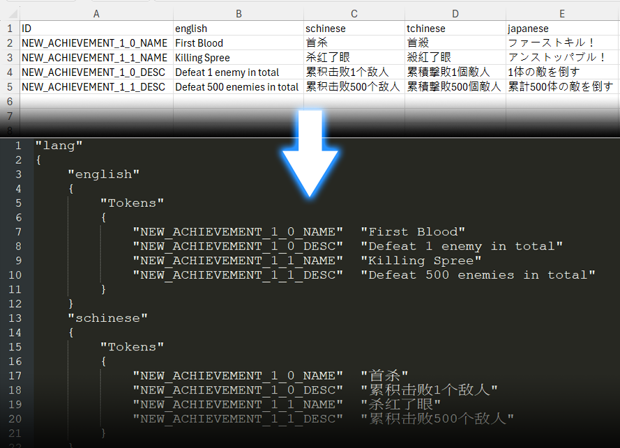

> _Author: bwaynesu_  
> _Created: April 16, 2025_  
> _Tags: Python, Steam, CSV, VDF_  

# Steam Achievement Localization CSV to VDF Converter

[繁體中文](README_Cht.md)

This tool is specifically designed to convert CSV format files to Valve Data Format (VDF) for Steam achievement localization. It helps game developers manage and update achievement translations across multiple languages.



## Features

- Supports any number and type of languages (not limited to the four in examples)
- Converts CSV files to Steam achievement VDF format
- Automatically identifies CSV file headers and language columns 
- Handles UTF-8 encoding with or without BOM
- Preserves existing VDF file structure while updating translations
- Displays detailed processing progress and statistics
- Allows specifying output filenames to avoid overwriting original files

## Usage

### Step-by-Step Guide

1. **Download VDF File from Steamworks**
   - Log in to your Steamworks developer account
   - Navigate to your game page and find the "Achievements" section under "Edit Store Page"
   - Download the existing achievement localization VDF file (usually named `xxx_loc_all.vdf`)

2. **Create a CSV File Based on the Template**
   - Use Excel or another spreadsheet software to create a CSV file
   - The first row must include headers: `ID` and your required language names (e.g., `ID,english,schinese,tchinese,japanese,german,french`)
   - Language names must match the language block names in the VDF file (usually lowercase)
   - Fill in all achievement IDs with corresponding translations in multiple languages
   - Save as a UTF-8 encoded CSV file

3. **Run the Python Script**
   - Place the VDF file and CSV file in the same directory
   - Open Command Prompt or Terminal
   - Execute the command: `python csv_to_vdf.py your_csv_file.csv your_vdf_file.vdf output_file.vdf`
   - After confirming the output file is correct, upload it back to Steamworks

### Basic Usage

```bash
python csv_to_vdf.py
```

This will use the default filenames:
- Input CSV: `Localization.csv`
- Input VDF: `loc_all.vdf`
- Output VDF: `loc_all_update.vdf`

### Specifying File Paths

```bash
python csv_to_vdf.py input_csv_file.csv input_vdf_file.vdf output_vdf_file.vdf
```

Example:
```bash
python csv_to_vdf.py .\Localization.csv .\loc_all.vdf .\loc_all_update.vdf
```

## CSV File Format

The CSV file should contain:
- A header row with an "ID" column and language names (e.g., english, schinese, tchinese, japanese)
- Each row containing an achievement ID and its translations in different languages
- The ID column typically includes identifiers like "NEW_ACHIEVEMENT_1_0_NAME"

Example:
```
ID,english,schinese,tchinese,japanese
NEW_ACHIEVEMENT_1_0_NAME,First Blood,首杀,首殺,ファーストキル！
NEW_ACHIEVEMENT_1_0_DESC,Defeat 1 enemy in total,累积击败1个敌人,累積擊敗1個敵人,1体の敵を倒す
```

## VDF File Format

The VDF file is Valve's format for localization, containing multiple language blocks, each with a Tokens section containing all achievement IDs and translation text.

Example:
```
"lang"
{
	"english"
	{
		"Tokens"
		{
			"NEW_ACHIEVEMENT_1_0_NAME"	""
			"NEW_ACHIEVEMENT_1_0_DESC"	""
		}
	}
	"schinese"
	{
		"Tokens"
		{
			"NEW_ACHIEVEMENT_1_0_NAME"	""
			"NEW_ACHIEVEMENT_1_0_DESC"	""
		}
	}
	"tchinese"
	{
		"Tokens"
		{
			"NEW_ACHIEVEMENT_1_0_NAME"	""
			"NEW_ACHIEVEMENT_1_0_DESC"	""
		}
	}
	"japanese"
	{
		"Tokens"
		{
			"NEW_ACHIEVEMENT_1_0_NAME"	""
			"NEW_ACHIEVEMENT_1_0_DESC"	""
		}
	}
}
```

## Notes

1. CSV files should be encoded in UTF-8 (with or without BOM)
2. The script preserves the original structure of the VDF file, only updating the translation content
3. If an ID in the CSV file is not found in the VDF file, the script will display a warning message
4. The order of entries in the CSV does not need to match the VDF (e.g., all NAME entries don't need to be listed before all DESC entries)

## Customization

To further customize the script functionality, you can modify the `csv_to_vdf.py` file:

- Enhanced error handling: Such as automatically adding entries when they're not found in the VDF